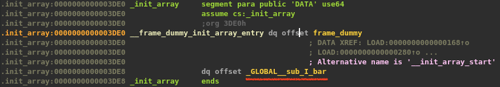
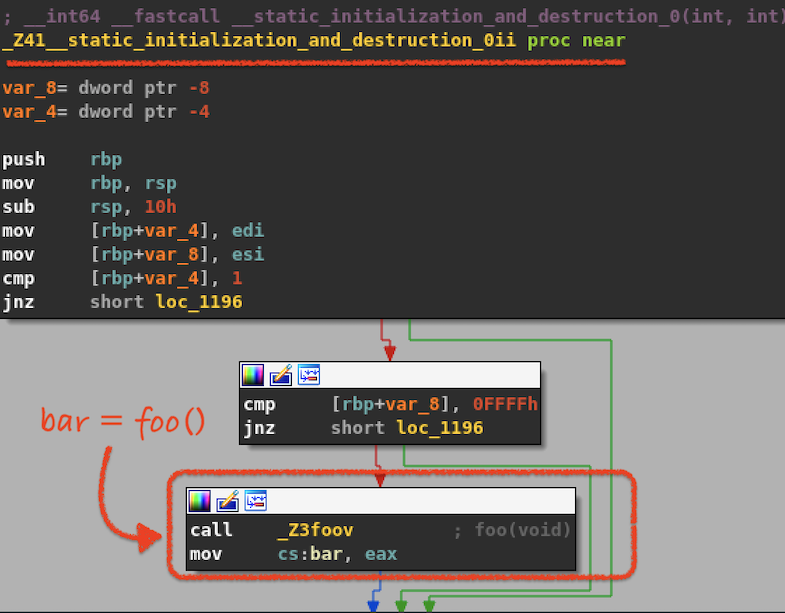
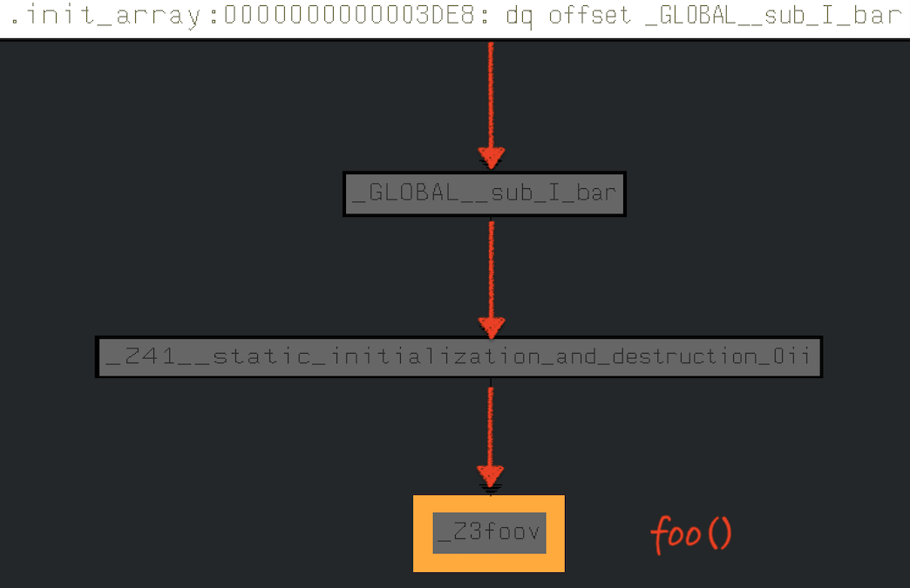

# GCC-Fun

This repository contains interesting tricks, twists and cool features of GNU Compiler Collection which could be used to execute code outside of the main function (before, after, or as a response to certain triggers).

```
 ██████╗  ██████╗ ██████╗    ███████╗██╗   ██╗███╗   ██╗
██╔════╝ ██╔════╝██╔════╝    ██╔════╝██║   ██║████╗  ██║
██║  ███╗██║     ██║         █████╗  ██║   ██║██╔██╗ ██║
██║   ██║██║     ██║         ██╔══╝  ██║   ██║██║╚██╗██║
╚██████╔╝╚██████╗╚██████╗    ██║     ╚██████╔╝██║ ╚████║
 ╚═════╝  ╚═════╝ ╚═════╝    ╚═╝      ╚═════╝ ╚═╝  ╚═══╝
 ```

### Techniques

* [Run code before/after the ```main()``` function using constructors/destructors](#pre-main-and-post-main-code)
* [Run code before the ```main()``` function using global variables](#global-variables-initialisers)
* [Run code before the ```main()``` function by initialising static variables](#static-variables-initialisers)

### Pre-main and post-main code

Each ELF executable and shared object file contains a section table, describing the sections inside the ELF object file. Two of those sections are specifically interesting because they offer opportunities to hide code that might not be immediately spotted during static analysis:

> The .init and .fini sections have a special purpose. If a function is placed in the .init section, the system will execute it before the main function. Also the functions placed in the .fini section will be executed by the system after the main function returns. This feature is utilized by compilers to implement global constructors and destructors in C++.


* ```.init``` - This section holds executable instructions that contribute to the process initialization code. When a program starts, the system arranges will execute the code in this section __before the main program entry point__ (called ```main``` in C programs).
* ```.fini``` - This section holds executable instructions that contribute to the process termination code. When a program exits normally, the system will execute the code in this section.

#### How to create constructors/destructors

Constructors and destructors are created using the ```constructor (priority)``` and ```destructor (priority)``` attributes. The priority number is optional and controls the order in which constructor and destructor functions are run. _A constructor with a smaller priority number runs before a constructor with a larger priority number. The opposite relationship holds for destructors_. 

**Note:** This logic order is important. If we have a constructor that allocates a resource and a destructor that deallocates the same resource, both functions typically have the same priority.

Example:

```c
#include <stdio.h>
  
int __attribute__ ((constructor)) premain() {
    printf("[*] In premain()\n");
    return 0;
}

int __attribute__ ((destructor)) postmain(){
    printf("[*] In postmain()\n");
    return 0;
}

int main(int argc, char **argv) {
    printf("[*] In main()\n");
    return 0;
}
```

Compile and test the code:

```bash
# gcc -Wall code.c 
# ./a.out 
[*] In premain()
[*] In main()
[*] In postmain()
```

#### How to detect constructors/destructors

Constructors and destructors are placed in the ```.init_array``` and ```.fini_array``` sections:

```bash
# objdump -t a.out  | grep ".init_array$"
0000000000003dd8 l    d  .init_array    0000000000000000              .init_array

# objdump -t a.out  | grep ".fini_array$"
0000000000003de8 l    d  .fini_array    0000000000000000              .fini_array
```

These sections are arrays of functions that get executed during the initialisation and termination phases. To figure out what functions were added by the compiler in those arrays, a quick solution is to use ```readelf``` and do a hexdump of those sections:

```bash
# readelf --hex-dump=.init_array a.out 
Hex dump of section '.init_array':
  0x00003dd8 30110000 00000000 35110000 00000000 0.......5.......

# readelf --hex-dump=.fini_array a.out 
Hex dump of section '.fini_array':
  0x00003de8 f0100000 00000000 4c110000 00000000 ........L.......
```

The ELF file analysed here is a 64-bit application:

```bash
# file a.out 
a.out: ELF 64-bit LSB pie executable, x86-64, version 1 (SYSV), dynamically linked, interpreter /lib64/ld-linux-x86-64.so.2, BuildID[sha1]=671aae3f8892a9864d08ea9fa7af1af5ebe6503b, for GNU/Linux 3.2.0, not stripped
```

That means those two arrays contain two functions each: the first one is a default one added by the compiler and the second is the one we added manually. The address of the additional constructor - the ```premain()``` function, is ```0x0000000000001153```. The address of the additional destructor - the ```postmain()``` function, is ```0x000000000000114c```.

We can easily verify this in IDA Pro. Here's the ```.fini_array``` section:


And the ```postmain()``` function, located at the address we extracted from the ```readelf``` hexdump:


### Global variables initialisers

The ```main()``` function is called *after initializing all the global variables*. Note that we're not in control of the order of the execution of the initialisers, but we can still execute actions and fly under the radar by initialising global variables. Consider the following code:

```c++
#include <stdio.h>

int foo();

int bar = foo();

int foo() {
    printf("in foo()\n");
    return 42;
}

int main(int argc, char **argv) {
    printf("in main()\n");
    return 0;
}
```

This initialises the global ```bar``` variable by calling the function ```foo()```. And it all happens before the execution of ```main()``` function and without any obvious clue about this. Let's compile it:

```bash
# g++ -Wall before-main-global.cpp 

# ./a.out 
in foo()
in main()
```

As in the previous scenario, when opening the output file in IDA Pro disassembler for static analysis, the function that is first presented is ```main()```. No hints at all about ```foo()```.

### Static variables initialisers

The C programming language ISO standard [ISO/IEC 9899:1999](https://www.iso.org/standard/29237.html) specifies that:

> _All objects with static storage duration shall be initialized (set to their initial values) before program startup._ The manner and timing of such initialization are otherwise unspecified.

Let's have a look at another interesting piece of code:

```c++
#include <stdio.h>
  
class BeforeMain
{
    static int foo;

};

int bar() {
    printf("in bar()\n");
    return 0;
}

int BeforeMain::foo = bar();

int main(int argc, char** argv) {
    printf("in main()\n");
    return 0;
}
```

In this case we have a class with a static class member that gets initialised by running the ```bar()``` function. It's not surprising that the execution flow starts with ```bar()``` function. 

```bash
# g++ before-main-static.cpp 
root@kali:~/code-play# ./a.out 
in bar()
in main()
```

Similarly, IDA Pro doesn't tell us anything abouth those static initialisers. It's useful to have this in mind when performing static analysis with IDA Pro or any other tool!

#### How to detect static/global initialisers

As in the case with ```constructors```, the initialisers for static class members and for global variables are stored in the ```.init_array``` section. For example, this is the initialiser for the _global_ ```bar``` variable:



Drilling down the code, through a few wrapper functions, we find the ```foo()``` function, used to initialise the ```bar``` variable:



To view the full call tree, we'll use [a port of qwingraph](https://github.com/WqyJh/qwingraph_qt5) which worked perfectly on Kali-rolling 2019.4:



### References

* [gdbinit man page](http://man7.org/linux/man-pages/man5/gdbinit.5.html)
* [GitHub gdbinit/Gdbinit](https://github.com/gdbinit/Gdbinit)
* [GDB Debugging cheatsheet](https://darkdust.net/files/GDB%20Cheat%20Sheet.pdf)
* [GDB Command Reference](https://visualgdb.com/gdbreference/commands/)
* [x86_64 GCC Calling convention](https://wiki.osdev.org/Calling_Conventions)
* [GCC Function attributes](https://gcc.gnu.org/onlinedocs/gcc-4.7.0/gcc/Function-Attributes.html)
* [The .init and .fini Sections](http://ftp.math.utah.edu/u/ma/hohn/linux/misc/elf/node3.html)
* [Abusing .CTORS and .DTORS for fun 'n profit](https://www.exploit-db.com/papers/13234)
* [qwingraph (wingraph written in qt4) ported to qt5.](https://github.com/WqyJh/qwingraph_qt5)
